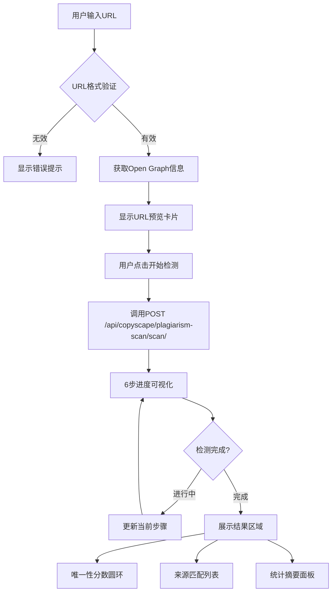

# Copyscope 全网抄袭检测 - 产品需求文档

## 1. 产品概述

**全网抄袭检测工具** - 帮助内容创作者、网站管理员和企业检测其网页内容是否被抄袭或重复使用，保护原创内容的唯一性和知识产权。

- **核心价值**: 通过智能相似度检索技术，快速发现互联网上的重复或近似内容
- **目标用户**: 内容创作者、SEO专家、网站管理员、学术研究者、企业品牌部门

## 2. 核心功能

### 2.1 功能模块列表

1. **Hero展示区**: 产品介绍和视觉引导
2. **URL输入与预览**: 单个URL检测入口
3. **进度可视化**: 6步检测流程展示
4. **结果展示**: 唯一性分数 + 来源匹配详情
5. **批量检测**: CSV批量上传和多URL处理
6. **监控设置**: 定期复查和告警配置

### 2.2 页面功能详情

| 页面模块 | 功能名称 | 功能描述 |
|---------|---------|---------|
| Hero区域 | 品牌展示 | 渐变背景 + 标题副标题 + lucide-react图标 (Search, Globe, ShieldCheck) |
| URL输入 | 核心输入区 | 大尺寸输入框(带https://前缀) + favicon自动显示 + URL格式验证 |
| URL预览 | 输入反馈 | 网站favicon + 页面标题(OG信息) + 域名描述 + 开始检测按钮 |
| 进度条 | 流程可视化 | 6步Steps组件(DNS→HTML→提取→分段→向量→检索) + 微光动画 + 预估时间 |
| 结果圆环 | 总体评分 | Progress circle (0-100%) + 颜色编码(绿≥90/黄70-89/红<70) |
| 来源列表 | 匹配详情 | MatchedSource卡片(favicon+标题+相似度条+片段引用+外部链接) |
| 统计摘要 | 数据汇总 | total_sources/exact_matches/near_duplicates/paraphrased统计 |
| 批量Tab | 批量处理 | Tab切换 + CSV拖拽上传 + 进度表格 + 结果直方图 |
| 监控设置 | 定期复查 | Switch开关 + 频率选项 + 邮件阈值InputNumber + 保存按钮 |

## 3. 核心流程

## 4. 用户界面设计

### 4.1 设计风格

- **主色调**: 深蓝色系 (#165DFF) 作为主色，搭配科技感渐变
- **辅助色**: 
  - 成功绿: #00B42A (唯一性≥90%)
  - 警告黄: #FAAD14 (唯一性70-89%)
  - 危险红: #F53F3F (唯一性<70%)
- **按钮风格**: 圆角按钮(Radius: 8px)，悬停时有微光效果
- **字体**: 系统默认字体栈，标题使用加粗
- **布局风格**: 卡片式设计，响应式Grid系统
- **图标风格**: lucide-react线性图标，统一size={20}

### 4.2 页面设计概览

| 模块名称 | UI元素 | 样式说明 |
|---------|--------|---------|
| Hero区 | 背景容器 | linear-gradient(135deg, #667eea 0%, #764ba2 100%) + 半透明装饰圆形 |
| URL输入 | Input.Group | 左侧https://前缀 + 右侧favicon图标 + 大尺寸(height: 56px) |
| URL预览 | Card组件 | 白色卡片 + favicon(32px) + 标题(16px bold) + 描述(14px gray) |
| 进度条 | Steps组件 | 6步横向步骤条 + 当前步骤Spin动画 + 完成Check图标 |
| 结果圆环 | Progress circle | 尺寸200px + stroke-width=10 + 动态颜色 + 分数居中显示 |
| 来源卡片 | Card.List | 每卡: favicon + 标题 + Progress条(颜色编码) + 片段引用 + ExternalLink按钮 |
| 统计摘要 | Row/Col栅格 | 4列统计数字 + 图标 + 描述文字 |
| 批量上传 | Upload.Dragger | 虚线边框区域 + 上传图标 + 格式说明文字 |
| 监控设置 | Card表单 | Switch组件 + Segmented频率选择 + InputNumber阈值 |

### 4.3 响应式设计

- **桌面端(≥992px)**: 双栏布局(左侧输入+结果，右侧详情)
- **平板端(768-991px)**: 单栏堆叠，保持卡片间距
- **移动端(<768px)**: 全宽单栏，优化触控目标尺寸(最小44px)

## 5. 技术约束

- **前端框架**: React 18 + TypeScript
- **UI组件库**: Ant Design 5.x
- **图标库**: lucide-react
- **状态管理**: React Hooks (useState/useEffect/useCallback)
- **API封装**: 已有 `@/api/copyscapeApi`
- **样式方案**: CSS Modules 或普通CSS文件
