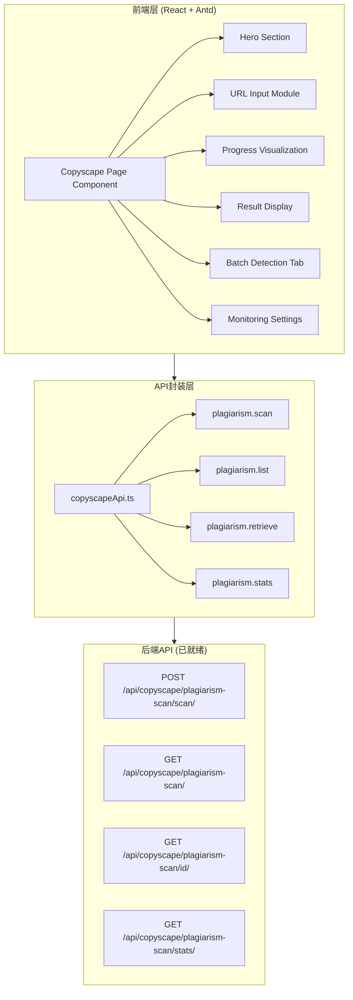
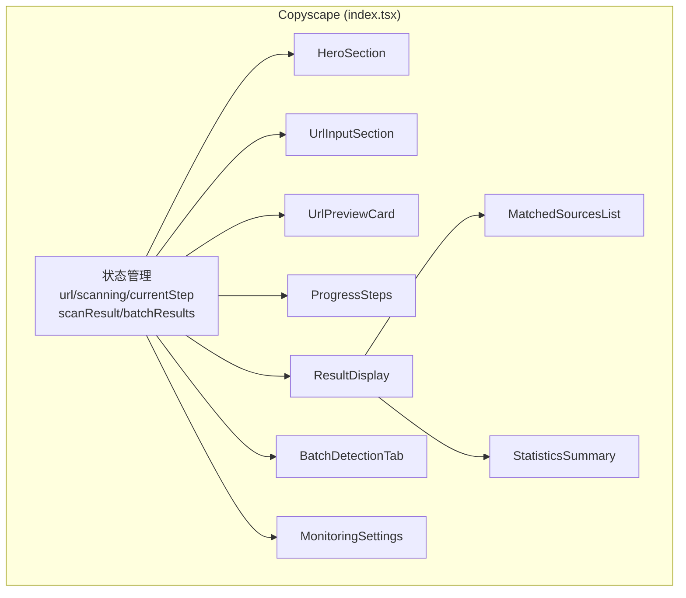

# Copyscope 全网抄袭检测 - 技术架构文档

## 1. 架构设计



## 2. 技术栈说明

- **前端框架**: React 18.2.0 + TypeScript 5.x
- **构建工具**: Vite 5.x (已有项目配置)
- **UI组件库**: Ant Design 5.x (antd)
  - 核心组件: Card, Button, Input, Progress, Steps, Table, Tabs, Tag, Switch, Upload, Space, Row, Col, Typography, Divider, Alert, Badge, Tooltip, Spin, Empty
- **图标库**: lucide-react (最新版本)
- **HTTP客户端**: axios (通过 @/utils/request 封装)
- **路由**: react-router-dom (已有配置)

## 3. 文件结构

```
frontend/src/pages/Copyscape/
├── index.tsx          # 主页面组件 (导出默认)
└── Copyscape.css      # 样式文件
```

## 4. API接口定义

### 4.1 核心扫描接口

**端点**: `POST /api/copyscape/plagiarism-scan/scan/`

**请求参数**:
```typescript
interface ScanRequest {
  original_text: string;      // URL地址或文本内容
  content_type?: string;      // 'web_url' | 'plain_text' (默认'web_url')
}
```

**响应数据类型**:
```typescript
interface PlagiarismScanItem {
  id: string;
  user: number | null;
  original_text: string;
  text_hash: string;
  content_type: string;
  content_type_display?: string;
  overall_similarity: number;      // 总体相似度 (0-100)
  unique_score: number;            // 唯一性分数 (0-100)
  plagiarism_risk: string;         // 风险等级
  match_count: number;             // 匹配数量
  total_sources: number;           // 总匹配来源数
  exact_matches: number;           // 完全匹配数
  near_duplicates: number;         // 近似重复数
  paraphrased: number;             // 改写/同义替换数
  plagiarism_breakdown: Record<string, PlagiarismBreakdown>;
  platform_distribution: Record<string, { count: number; avg_similarity: number }>;
  sentence_analyses: SentenceAnalysis[];
  executive_summary: string;
  detailed_report: string;
  improvement_suggestions: ImprovementSuggestion[];
  scan_metadata: Record<string, any>;
  processing_time_ms: number;
  created_at: string;
  updated_at: string;
  match_sources?: MatchedSource[];  // 匹配来源详情数组
}
```

### 4.2 匹配来源数据结构

```typescript
interface MatchedSource {
  source_url: string;
  source_title: string;
  domain: string;
  platform_type: string;
  similarity_percent: number;       // 相似度百分比 (0-100)
  matched_words: number;
  total_words: number;
  match_type: string;               // 'exact' | 'near_duplicate' | 'paraphrased'
  confidence: number;
  matched_snippets: Array<{
    text: string;
    similarity: number;
  }>;
  source_excerpt: string;
  context_before: string;
  context_after: string;
  publish_date: string | null;
  last_crawled: string | null;
  page_authority: number;
  is_verified: boolean;
  verification_status: string;
  risk_level: string;
  notes: string;
  created_at: string;
}
```

## 5. 组件架构图



## 6. 状态管理设计

### 6.1 主要状态变量

```typescript
// URL输入状态
const [url, setUrl] = useState<string>('');
const [urlPreview, setUrlPreview] = useState<UrlPreviewInfo | null>(null);

// 扫描过程状态
const [scanning, setScanning] = useState<boolean>(false);
const [currentStep, setCurrentStep] = useState<number>(0);
const [estimatedTime, setEstimatedTime] = useState<string>('');

// 结果状态
const [scanResult, setScanResult] = useState<PlagiarismScanItem | null>(null);

// 批量检测状态
const [activeTab, setActiveTab] = useState<'single' | 'batch'>('single');
const [batchFile, setBatchFile] = useState<File | null>(null);
const [batchResults, setBatchResults] = useState<PlagiarismScanItem[]>([]);
const [batchProgress, setBatchProgress] = useState<BatchItem[]>([]);

// 监控设置状态
const [monitoringEnabled, setMonitoringEnabled] = useState<boolean>(false);
const [monitorFrequency, setMonitorFrequency] = useState<'weekly' | 'monthly' | 'off'>('off');
const [alertThreshold, setAlertThreshold] = useState<number>(70);
```

### 6.2 自定义类型定义

```typescript
interface UrlPreviewInfo {
  favicon: string;
  title: string;
  domain: string;
  description: string;
}

interface BatchItem {
  id: string;
  url: string;
  label: string;
  status: 'pending' | 'scanning' | 'completed' | 'error';
  result?: PlagiarismScanItem;
  error?: string;
  similarity?: number;
}
```

## 7. 关键实现要点

### 7.1 URL验证逻辑
- 使用正则表达式验证URL格式
- 自动补全https://前缀（如果缺失）
- 提取域名用于favicon生成

### 7.2 Favicon获取策略
- 使用Google Favicon API: `https://www.google.com/s2/favicons?domain=${domain}&sz=64`
- 失败时显示默认Globe图标作为fallback

### 7.3 进度模拟实现
- 由于真实进度需后端支持，前端采用模拟进度展示
- 6步依次推进，每步间隔1-2秒
- 显示预估剩余时间（倒计时）

### 7.4 结果渲染优化
- 使用虚拟滚动处理大量来源列表（如果>50条）
- 懒加载snippet展开详情
- 颜色编码直观展示风险等级

### 7.5 批量处理流程
- CSV解析：提取url和label两列
- 并发控制：最多同时处理3个URL
- 实时更新表格状态和进度
- 错误隔离：单个失败不影响其他任务

## 8. 性能优化策略

- **防抖处理**: URL输入框300ms防抖，避免频繁验证
- **内存管理**: 批量结果分页加载，避免DOM节点过多
- **请求取消**: 组件卸载时取消未完成的API请求
- **缓存策略**: 对相同URL的重复检测结果可考虑短期缓存

## 9. 错误处理机制

- **网络错误**: message.error('网络连接失败，请检查网络')
- **URL无效**: 表单级错误提示 + Input红色边框
- **扫描失败**: Alert组件展示详细错误信息 + 重试按钮
- **超时处理**: 30秒超时提示 + 取消选项
- **空结果**: Empty组件友好提示 + 引导操作建议

## 10. 测试覆盖范围

- **单元测试**: URL验证函数、分数颜色计算逻辑
- **集成测试**: API调用mock、状态流转测试
- **E2E测试**: 完整扫描流程、批量上传流程
