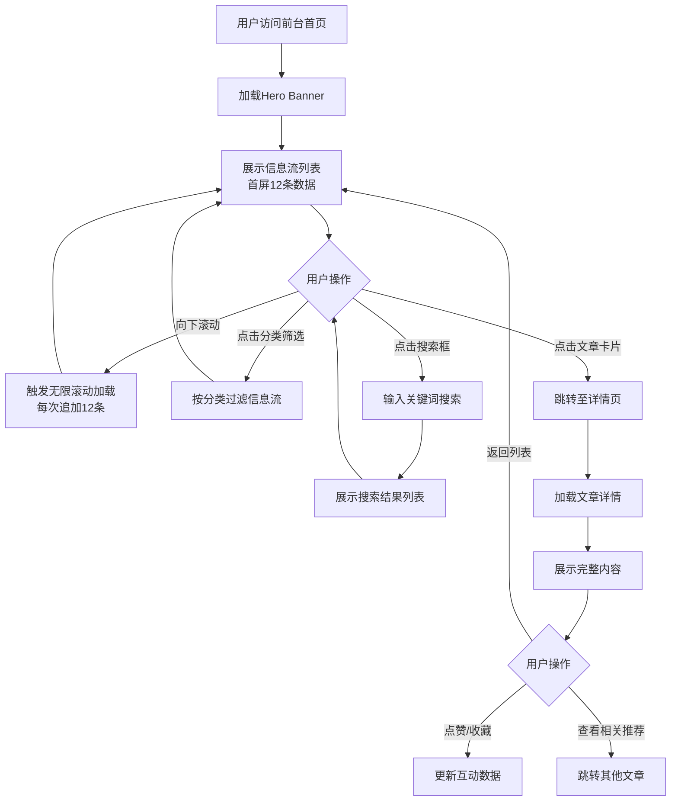

# 模块二：前台首页重构 + 1000条信息流体系 + 独立详情页全套 - PRD产品需求文档

## 1. 产品概述

**一键到底（YiJiDaoDi）** 前台门户系统重构，打造企业级信息聚合平台。为访客提供高效、美观、易用的内容浏览体验，支持1000+条信息流的流畅展示与独立详情页深度阅读。

- **核心目标**：构建高性能前台展示层，实现信息流瀑布式加载、分类筛选、全文检索、详情页完整体验
- **目标用户**：网站访客、潜在客户、行业从业者、内容消费者
- **商业价值**：提升品牌形象、增加用户停留时间、提高内容转化率、为后续AI Agent植入奠定基础

---

## 2. 核心功能

### 2.1 用户角色

| 角色 | 访问方式 | 核心权限 |
|------|----------|----------|
| 访客 | 直接访问前台首页 | 浏览信息流、查看详情、搜索内容、分类筛选 |
| 已登录用户 | 前台 + 后台管理 | 访客全部权限 + 后台管理权限（模块一已完成） |

### 2.2 功能模块

1. **前台首页**：Hero区域、导航栏、信息流列表、侧边栏推荐、底部Footer
2. **信息流体系**：1000条Mock数据、瀑布流/列表视图切换、无限滚动、分类标签、排序筛选
3. **独立详情页**：文章详情、作者信息、相关推荐、评论区、分享功能、阅读进度

### 2.3 页面详情

| 页面名称 | 模块名称 | 功能描述 |
|-----------|-------------|---------------------|
| 前台首页 | Hero Banner | 全屏视觉冲击区，展示平台核心价值主张，支持3-5张轮播图自动切换 |
| 前台首页 | 导航系统 | 顶部固定导航，包含Logo、主导航菜单、搜索框、登录入口、语言切换 |
| 前台首页 | 信息流主区域 | 支持卡片式/列表式双视图切换，每页显示12-20条，无限滚动加载 |
| 前台首页 | 分类筛选区 | 多维度筛选：分类、标签、时间范围、热度排序、最新发布 |
| 前台首页 | 侧边栏 | 热门文章Top10、最新动态、广告位/推广区、标签云 |
| 前台首页 | Footer | 网站地图、友情链接、联系方式、备案信息、社交媒体图标 |
| 详情页 | 文章主体 | 标题、封面图、元数据（作者/时间/阅读量）、正文内容（Markdown渲染） |
| 详情页 | 交互功能区 | 点赞/收藏/分享按钮、目录导航（TOC）、阅读进度条 |
| 详情页 | 作者卡片 | 头像、简介、其他文章列表、关注按钮 |
| 详情页 | 相关推荐 | 智能推荐5-8篇相关文章，基于分类/标签算法 |
| 详情页 | 评论区 | 评论列表、发表评论、回复功能、点赞评论（预留后端接口） |

---

## 3. 核心流程

### 3.1 用户浏览流程



### 3.2 信息流加载流程

```mermaid
flowchart TD
    A[页面初始化] --> B[请求第1页数据<br/>page=1, size=12]
    B --> C[渲染前12条信息卡片]
    C --> D[监听滚动事件]
    D --> E{距离底部<200px?}
    E -->|是| F[请求下一页数据<br/>page++]
    E -->|否| D
    F --> G{还有数据?}
    G -->|是| H[追加到列表末尾]
    G -->|否| I[显示"已加载全部"]
    H --> D
```

---

## 4. 用户界面设计

### 4.1 设计风格

**设计定位**：企业级极简现代风（去AI味，对标微软Fluent Design + 火山引擎视觉规范）

- **主色调**：
  - 主色：`#2563EB`（专业蓝）- 按钮、链接、强调元素
  - 辅助色：`#0F172A`（深墨灰）- 标题、重要文字
  - 背景色：`#FFFFFF`（纯白）- 主背景
  - 次背景：`#F8FAFC`（浅灰白）- 卡片背景、分区背景
  - 边框色：`#E2E8F0`（浅灰）- 分割线、卡片边框

- **文字层级**：
  - H1标题：32px / Font-weight: 700
  - H2标题：24px / Font-weight: 600
  - H3标题：20px / Font-weight: 600
  - 正文：16px / Font-weight: 400
  - 辅助文字：14px / Font-weight: 400
  - Caption：12px / Font-weight: 400

- **字体选择**：
  - 中文：思源黑体（Noto Sans SC）
  - 英文/数字：Inter（Google Fonts）
  - 代码：JetBrains Mono

- **按钮风格**：
  - 主要按钮：圆角8px，蓝色填充，hover时加深10%
  - 次要按钮：白色背景，蓝色边框，hover时背景变浅蓝
  - 文字按钮：无背景，蓝色文字，hover时加下划线

- **布局风格**：
  - 最大宽度：1200px居中容器
  - 卡片间距：16px网格间距
  - 圆角统一：8px（卡片）、12px（大区块）
  - 阴影：`0 1px 3px rgba(0,0,0,0.08)` 轻微阴影

- **图标风格**：使用 Lucide Icons（线性图标库），保持一致性

- **动效规范**：
  - 过渡时长：200ms ease-out
  - Hover效果：transform translateY(-2px) + shadow增强
  - 加载动画：Skeleton骨架屏脉冲效果
  - 页面切换：淡入淡出300ms

### 4.2 页面设计概览

| 页面名称 | 模块名称 | UI元素说明 |
|-----------|-------------|-------------|
| 前台首页 | Hero Banner | 全宽背景图+渐变遮罩，居中大标题（48px粗体），副标题（18px），CTA按钮组（主次各一），高度500px |
| 前台首页 | 顶部导航 | 固定定位sticky top-0，高度64px，Logo左侧，菜单居中，搜索+登录右侧，背景透明→滚动后变白+阴影 |
| 前台首页 | 信息流列表 | CSS Grid三列布局（桌面端），卡片包含：封面图（16:9）、标题（2行截断）、摘要（3行）、元数据行（分类标签+时间+阅读量） |
| 前台首页 | 侧边栏 | 宽度320px固定，热门文章列表（排名数字+标题+热度值），标签云（不同字号颜色深浅） |
| 前台首页 | Footer | 四列布局（关于我们、快速链接、联系方式、关注我们），深色背景`#1E293B`，版权信息居中 |
| 详情页 | 文章头部 | 封面图全宽，标题H1（36px），元数据行（头像+作者名+发布时间·阅读量·点赞数），操作按钮栏（点赞/收藏/分享） |
| 详情页 | 正文区域 | 最大宽度800px居中，Markdown渲染，代码高亮，图片响应式，段落间距1.5em |
| 详情页 | 目录导航 | 右侧粘性定位，提取H2/H3标题，当前章节高亮，点击平滑滚动 |
| 详情页 | 底部评论区 | 评论输入框（textarea），评论列表（头像+用户名+时间+内容+回复按钮），"加载更多"分页 |

### 4.3 响应式适配

**桌面优先策略（Desktop-first）**

| 断点 | 宽度范围 | 布局调整 |
|------|----------|----------|
| Desktop（桌面） | ≥1200px | 三列信息流 + 320px侧边栏，完整导航 |
| Laptop（笔记本） | 992-1199px | 两列信息流 + 280px侧边栏，导航收缩 |
| Tablet（平板） | 768-991px | 单列信息流 + 侧边栏折叠到底部，汉堡菜单 |
| Mobile（手机） | <768px | 单列全宽信息流，底部Tab导航，卡片简化 |

**触屏优化**：
- 按钮最小触控区域：44x44px
- 间距增大：移动端padding/margin增加50%
- 手势支持：左滑返回、下拉刷新

### 4.4 性能要求

- **首屏加载时间**：<1.5秒（3G网络）
- **Lighthouse性能评分**：>90分
- **图片懒加载**：Intersection Observer API
- **虚拟滚动**：信息流超过100条时启用（可选优化）
- **代码分割**：路由级别懒加载，详情页单独chunk
- **缓存策略**：静态资源强缓存，API数据缓存5分钟

---

## 5. 数据需求

### 5.1 Mock数据规模

- **信息流总数**：1000条文章数据
- **分类数量**：8-12个一级分类
- **标签数量**：30-50个标签
- **作者数量**：10-15个虚拟作者
- **评论数据**：每篇文章3-20条评论（预留给详情页）

### 5.2 数据字段结构

**文章数据结构**：
```typescript
interface Article {
  id: number;
  title: string;           // 文章标题
  summary: string;         // 摘要（150字以内）
  content: string;         // 正文内容（Markdown格式）
  coverImage: string;      // 封面图URL
  categoryId: number;      // 分类ID
  tags: string[];          // 标签数组
  authorId: number;        // 作者ID
  authorName: string;      // 作者名（冗余存储）
  avatar: string;          // 作者头像
  publishTime: string;     // 发布时间ISO格式
  readCount: number;       // 阅读量
  likeCount: number;       // 点赞数
  commentCount: number;    // 评论数
  isRecommended: boolean;  // 是否推荐
  status: 'published' | 'draft' | 'archived';  // 状态
}
```

**分类数据结构**：
```typescript
interface Category {
  id: number;
  name: string;            // 分类名称
  icon: string;            // 图标名称（Lucide Icons）
  description: string;     // 分类描述
  articleCount: number;    // 文章数量
}
```

---

## 6. 验收标准

### 6.1 功能验收

- [ ] 前台首页正常访问，Hero Banner轮播自动切换（3-5秒间隔）
- [ ] 信息流首次加载12条数据，滚动触发无限加载
- [ ] 分类筛选功能正常，点击分类标签过滤列表
- [ ] 搜索框可输入关键词，回车或点击搜索（前端Mock过滤）
- [ ] 视图切换（卡片/列表）正常工作
- [ ] 点击文章卡片跳转详情页，URL携带id参数
- [ ] 详情页正确展示文章完整内容（Markdown渲染）
- [ ] 详情页目录导航自动生成，点击锚点定位
- [ ] 点赞/收藏按钮有交互动画（数值+1）
- [ ] 相关推荐文章列表展示正确
- [ ] 响应式布局在Desktop/Tablet/Mobile均正常显示

### 6.2 性能验收

- [ ] 首屏FCP < 1.5s
- [ ] 无控制台错误和警告
- [ ] 图片懒加载生效（Network面板验证）
- [ ] 滚动流畅，无明显卡顿（60fps）

### 6.3 UI/UX验收

- [ ] 设计风格符合企业极简规范，无AI模板痕迹
- [ ] 颜色、字体、间距符合设计规范文档
- [ ] 所有交互有hover/focus/active状态反馈
- [ ] 移动端触控友好，按钮足够大

### 6.4 兼容性验收

- [ ] Chrome 90+ 正常
- [ ] Firefox 88+ 正常
- [ Safari 14+ 正常
- [ ] Edge 90+ 正常
