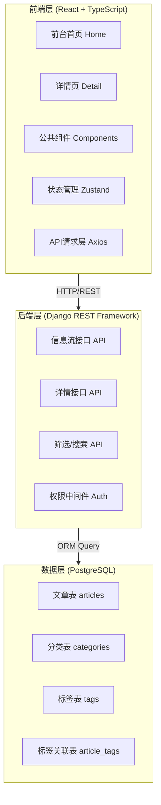
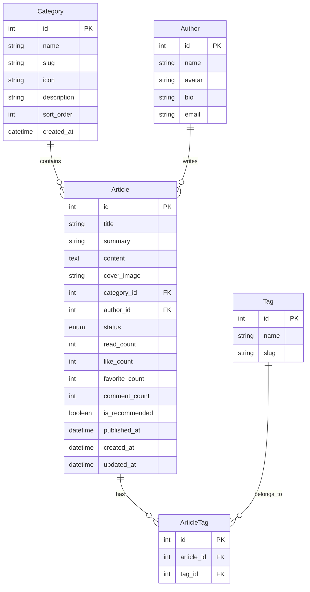

# 模块二：前台首页重构 + 1000条信息流体系 + 独立详情页全套 - 技术架构文档

## 1. 架构设计



---

## 2. 技术选型

### 2.1 前端技术栈

| 技术 | 版本 | 用途说明 |
|------|------|----------|
| React | 18.3.1 | 核心UI框架 |
| TypeScript | 5.6.2 | 类型安全 |
| Vite | 5.4.8 | 构建工具 |
| React Router DOM | 6.26.0 | 路由管理 |
| Ant Design | 5.21.0 | UI组件库（后台沿用） |
| Zustand | 4.5.5 | 状态管理（前台新增store） |
| Axios | 1.7.7 | HTTP客户端 |
| Lucide React | 最新 | 图标库（前台专用） |
| CSS Modules / Tailwind | - | 样式方案（前台新页面用CSS Modules保持独立） |

### 2.2 后端技术栈（已有）

| 技术 | 用途 |
|------|------|
| Django 4.x + DRF | RESTful API框架 |
| PostgreSQL | 主数据库（无Redis） |
| JWT | 身份认证 |
| django-cors-headers | 跨域处理 |

### 2.3 关键技术决策

- **无Redis**：分页、统计、临时数据全部由PostgreSQL承担
- **前台样式隔离**：前台页面使用CSS Modules或内联样式，与后台Ant Design主题不冲突
- **Mock优先**：前端先用Mock数据进行开发，后端接口就位后无缝切换
- **性能优化**：图片懒加载、无限滚动、虚拟列表（可选）

---

## 3. 目录结构规划

### 3.1 前台新增目录结构

```
frontend/src/
├── pages/
│   ├── Home/                    # 前台首页
│   │   ├── index.tsx            # 首页主组件
│   │   ├── components/
│   │   │   ├── HeroBanner.tsx   # Hero轮播区
│   │   │   ├── ArticleGrid.tsx  # 文章网格/列表
│   │   │   ├── ArticleCard.tsx  # 文章卡片
│   │   │   ├── FilterBar.tsx    # 筛选栏
│   │   │   └── Pagination.tsx   # 加载更多/分页
│   │   └── styles.module.css    # 首页样式
│   │
│   ├── Detail/                  # 详情页
│   │   ├── index.tsx            # 详情主组件
│   │   ├── components/
│   │   │   ├── ArticleHeader.tsx    # 文章头部
│   │   │   ├── ArticleContent.tsx   # 正文内容
│   │   │   ├── TableOfContents.tsx  # 目录导航
│   │   │   ├── AuthorCard.tsx       # 作者卡片
│   │   │   ├── RelatedArticles.tsx  # 相关推荐
│   │   │   ├── CommentSection.tsx   # 评论区
│   │   │   └── ActionButtons.tsx    # 点赞/收藏/分享
│   │   └── styles.module.css
│   │
│   └── Login/ ...               # 已有（模块一）
│
├── layouts/
│   ├── AdminLayout.tsx          # 已有（后台布局）
│   └── FrontLayout.tsx          # 新增：前台布局（Header+Footer）
│
├── components/
│   ├── FrontHeader.tsx          # 新增：前台导航栏
│   ├── FrontFooter.tsx          # 新增：前台底部
│   └── ...                      # 已有组件
│
├── hooks/
│   ├── useInfiniteScroll.ts     # 新增：无限滚动Hook
│   └── useArticleFilter.ts      # 新增：文章筛选Hook
│
├── store/
│   ├── useAuthStore.ts          # 已有
│   └── useArticleStore.ts       # 新增：文章状态管理
│
├── mock/
│   ├── articles.ts              # 新增：1000条Mock文章数据
│   ├── categories.ts            # 新增：分类Mock数据
│   └── authors.ts               # 新增：作者Mock数据
│
├── api/
│   ├── auth.ts                  # 已有
│   ├── content.ts               # 已有（可扩展）
│   └── frontApi.ts              # 新增：前台API封装
│
├── types/
│   └── article.ts               # 新增：类型定义
│
└── router/
    └── index.tsx                # 扩展：添加前台路由
```

### 3.2 后端新增目录结构

```
backend/
├── front_app/                   # 新增：前台应用
│   ├── __init__.py
│   ├── models.py                # 文章、分类、标签模型
│   ├── serializers.py           # 序列化器
│   ├── views.py                 # 视图集（列表、详情、筛选、热门）
│   ├── urls.py                  # 路由配置
│   ├── permissions.py           # 权限控制（游客/登录用户）
│   └── pagination.py            # 自定义分页器
│
├── content_app/                 # 已有（可复用或扩展）
│
└── fangdudu_backend/
    └── settings.py              # 注册front_app
```

---

## 4. 路由定义

### 4.1 前端路由

| 路由路径 | 组件 | 说明 |
|----------|------|------|
| `/` | `FrontLayout > Home` | 前台首页（重定向目标） |
| `/article/:id` | `FrontLayout > Detail` | 文章详情页 |
| `/category/:id` | `FrontLayout > Home` | 分类筛选页（复用首页+参数） |
| `/search?q=keyword` | `FrontLayout > Home` | 搜索结果页（复用首页+参数） |
| `/login` | `Login` | 登录页（已有） |
| `/admin/*` | `AdminLayout > *` | 后台管理（已有） |

### 4.2 后端API路由

| HTTP方法 | 路径 | 说明 | 权限 |
|----------|------|------|------|
| GET | `/api/front/articles/` | 文章列表（分页+筛选） | 公开 |
| GET | `/api/front/articles/:id/` | 文章详情 | 公开 |
| GET | `/api/front/categories/` | 分类列表 | 公开 |
| GET | `/api/front/hot-articles/` | 热门榜单Top10 | 公开 |
| GET | `/api/front/search/?q=` | 搜索接口 | 公开 |
| POST | `/api/front/articles/:id/like/` | 点赞 | 登录用户 |
| POST | `/api/front/articles/:id/favorite/` | 收藏 | 登录用户 |

---

## 5. API接口定义

### 5.1 文章列表接口

**请求**
```
GET /api/front/articles/?page=1&page_size=12&category=1&sort=-publish_time&search=关键词
```

**响应**
```typescript
interface ArticleListResponse {
  count: number;           // 总数
  next: string | null;     // 下一页URL
  previous: string | null; // 上一页URL
  results: Article[];      // 文章数组
}

// 查询参数
interface ArticleListParams {
  page?: number;           // 页码，默认1
  page_size?: number;      // 每页数量，默认12，最大50
  category?: number;       // 分类ID筛选
  tag?: string;            // 标签名筛选
  sort?: string;           // 排序方式：-publish_time, -read_count, -like_count
  search?: string;         // 搜索关键词
  status?: string;         // 状态过滤（后台用），默认published
}
```

### 5.2 文章详情接口

**请求**
```
GET /api/front/articles/123/
```

**响应**
```typescript
interface ArticleDetailResponse {
  id: number;
  title: string;
  summary: string;
  content: string;          // Markdown格式正文
  cover_image: string;
  category: {
    id: number;
    name: string;
  };
  tags: { id: number; name: string }[];
  author: {
    id: number;
    name: string;
    avatar: string;
    bio: string;
  };
  publish_time: string;     // ISO 8601
  read_count: number;
  like_count: number;
  comment_count: number;
  is_liked: boolean;        // 当前用户是否点赞
  is_favorited: boolean;    // 当前用户是否收藏
  related_articles: Article[];  // 相关推荐（5篇）
}
```

### 5.3 分类列表接口

**请求**
```
GET /api/front/categories/
```

**响应**
```typescript
interface CategoryListResponse {
  results: Category[];
}

interface Category {
  id: number;
  name: string;
  icon: string;             // Lucide图标名
  article_count: number;
}
```

### 5.4 热门榜单接口

**请求**
```
GET /api/front/hot-articles/?period=week
```

**响应**
```typescript
interface HotArticlesResponse {
  period: 'day' | 'week' | 'month';
  results: HotArticle[];
}

interface HotArticle {
  rank: number;             // 排名
  id: number;
  title: string;
  cover_image: string;
  read_count: number;
  like_count: number;
  category_name: string;
}
```

---

## 6. 数据模型设计

### 6.1 ER关系图



### 6.2 数据定义语言（DDL）

```sql
-- 分类表
CREATE TABLE front_category (
    id SERIAL PRIMARY KEY,
    name VARCHAR(100) NOT NULL UNIQUE,
    slug VARCHAR(100) NOT NULL UNIQUE,
    icon VARCHAR(50) DEFAULT 'folder',
    description TEXT,
    sort_order INTEGER DEFAULT 0,
    is_active BOOLEAN DEFAULT TRUE,
    created_at TIMESTAMP WITH TIME ZONE DEFAULT NOW()
);

CREATE INDEX idx_front_category_slug ON front_category(slug);
CREATE INDEX idx_front_category_active ON front_category(is_active);

-- 作者表（可与后台User关联，也可独立）
CREATE TABLE front_author (
    id SERIAL PRIMARY KEY,
    user_id INTEGER UNIQUE,  -- 关联后台User表，可为空（虚拟作者）
    name VARCHAR(100) NOT NULL,
    avatar VARCHAR(500),
    bio TEXT,
    email VARCHAR(200),
    created_at TIMESTAMP WITH TIME ZONE DEFAULT NOW()
);

-- 标签表
CREATE TABLE front_tag (
    id SERIAL PRIMARY KEY,
    name VARCHAR(50) NOT NULL UNIQUE,
    slug VARCHAR(50) NOT NULL UNIQUE
);

CREATE INDEX idx_front_tag_slug ON front_tag(slug);

-- 文章主表
CREATE TABLE front_article (
    id SERIAL PRIMARY KEY,
    title VARCHAR(500) NOT NULL,
    summary TEXT,
    content TEXT,                   -- Markdown格式正文
    cover_image VARCHAR(500),
    category_id INTEGER REFERENCES front_category(id) ON DELETE SET NULL,
    author_id INTEGER REFERENCES front_author(id) ON DELETE SET NULL,

    status VARCHAR(20) DEFAULT 'draft' CHECK (status IN ('draft', 'published', 'archived')),

    -- 统计字段
    read_count INTEGER DEFAULT 0,
    like_count INTEGER DEFAULT 0,
    favorite_count INTEGER DEFAULT 0,
    comment_count INTEGER DEFAULT 0,

    is_recommended BOOLEAN DEFAULT FALSE,

    published_at TIMESTAMP WITH TIME ZONE,
    created_at TIMESTAMP WITH TIME ZONE DEFAULT NOW(),
    updated_at TIMESTAMP WITH TIME ZONE DEFAULT NOW()
);

-- 索引优化（关键查询性能）
CREATE INDEX idx_front_article_status ON front_article(status);
CREATE INDEX idx_front_article_category ON front_article(category_id);
CREATE INDEX idx_front_article_author ON front_article(author_id);
CREATE INDEX idx_front_article_published ON front_article(published_at DESC);
CREATE INDEX idx_front_article_read_count ON front_article(read_count DESC);
CREATE INDEX idx_front_article_recommend ON front_article(is_recommended) WHERE is_recommended = TRUE;

-- 全文搜索索引（PostgreSQL tsvector）
ALTER TABLE front_article ADD COLUMN search_vector TSVECTOR;
CREATE INDEX idx_front_article_search ON front_article USING gin(search_vector);
CREATE TRIGGER front_article_search_update BEFORE INSERT OR UPDATE ON front_article
    FOR EACH ROW EXECUTE FUNCTION
    tsvector_update_trigger(search_vector, 'pg_catalog.simple', title, summary, content);

-- 文章-标签多对多关联表
CREATE TABLE front_article_tag (
    id SERIAL PRIMARY KEY,
    article_id INTEGER NOT NULL REFERENCES front_article(id) ON DELETE CASCADE,
    tag_id INTEGER NOT NULL REFERENCES front_tag(id) ON DELETE CASCADE,
    UNIQUE(article_id, tag_id)
);

CREATE INDEX idx_front_article_tag_article ON front_article_tag(article_id);
CREATE INDEX idx_front_article_tag_tag ON front_article_tag(tag_id);

-- 用户点赞记录表
CREATE TABLE front_article_like (
    id SERIAL PRIMARY KEY,
    article_id INTEGER NOT NULL REFERENCES front_article(id) ON DELETE CASCADE,
    user_id INTEGER NOT NULL,  -- 关联后台用户
    created_at TIMESTAMP WITH TIME ZONE DEFAULT NOW(),
    UNIQUE(article_id, user_id)
);

-- 用户收藏记录表
CREATE TABLE front_article_favorite (
    id SERIAL PRIMARY KEY,
    article_id INTEGER NOT NULL REFERENCES front_article(id) ON DELETE CASCADE,
    user_id INTEGER NOT NULL,
    created_at TIMESTAMP WITH TIME ZONE DEFAULT NOW(),
    UNIQUE(article_id, user_id)
);
```

### 6.3 初始数据脚本

```sql
-- 插入初始分类（8个一级分类）
INSERT INTO front_category (name, slug, icon, description, sort_order) VALUES
('人工智能', 'ai', 'brain-circuit', 'AI前沿技术与行业应用', 1),
('软件开发', 'dev', 'code-2', '编程语言、框架、工程实践', 2),
('产品设计', 'design', 'palette', 'UI/UX设计、产品设计思维', 3),
('数据分析', 'data', 'bar-chart-3', '数据科学、BI、可视化', 4),
('创业商业', 'business', 'trending-up', '创业经验、商业模式、市场洞察', 5),
('安全技术', 'security', 'shield-check', '网络安全、隐私保护、合规', 6),
('云计算', 'cloud', 'cloud', '云原生、DevOps、基础设施', 7),
('行业资讯', 'news', 'newspaper', '科技动态、政策解读、趋势报告', 8);

-- 插入虚拟作者（10个）
INSERT INTO front_author (name, avatar, bio) VALUES
('张明远', 'https://api.dicebear.com/7.x/avataaars/svg?seed=zhang', '资深AI架构师，10年机器学习经验'),
('李思涵', 'https://api.dicebear.com/7.x/avataaars/svg?seed=li', '全栈开发者，开源社区活跃贡献者'),
('王雨晴', 'https://api.dicebear.com/7.x/avataaars/svg?seed=wang', '产品设计总监，前BAT设计师'),
('陈浩然', 'https://api.dicebear.com/7.x/avataaars/svg?seed=chen', '数据科学家，专注NLP领域'),
('刘诗琪', 'https://api.dicebear.com/7.x/avataaars/svg?seed=liu', '安全研究员，CISSP认证专家'),
('赵天宇', 'https://api.dicebear.com/7.x/avataaars/svg?seed=zhao', '云架构师，AWS/Azure双认证'),
('孙晓萌', 'https://api.dicebear.com/7.x/avataaars/svg?seed=sun', '创业者，连续创立3家科技公司'),
('周子轩', 'https://api.dicebear.com/7.x/avataaars/svg?seed=zhou', '技术博主，全网粉丝50万+'),
('吴佳怡', 'https://api.dicebear.com/7.x/avataaars/svg?seed=wu', '产品经理，专注B端SaaS产品'),
('郑凯文', 'https://api.dicebear.com/7.x/avataaars/svg?seed=zheng', 'DevOps工程师，Kubernetes专家');

-- 插入初始标签（30个）
INSERT INTO front_tag (name, slug) VALUES
('大语言模型', 'llm'), ('GPT', 'gpt'), ('机器学习', 'ml'), ('深度学习', 'dl'),
('React', 'react'), ('Python', 'python'), ('TypeScript', 'typescript'), ('Vue', 'vue'),
('用户体验', 'ux'), ('界面设计', 'ui-design'), ('Figma', 'figma'), ('设计系统', 'design-system'),
('Python数据分析', 'python-data'), ('SQL', 'sql'), ('可视化', 'visualization'), ('ETL', 'etl'),
('融资', 'funding'), ('商业模式', 'business-model'), ('增长黑客', 'growth'), ('MVP', 'mvp'),
('渗透测试', 'pentest'), ('零信任', 'zero-trust'), ('GDPR', 'gdpr'), ('加密', 'encryption'),
('Docker', 'docker'), ('Kubernetes', 'k8s'), ('微服务', 'microservice'), ('CI/CD', 'cicd'),
('AIGC', 'aigc'), ('Prompt Engineering', 'prompt-engineering');
```

---

## 7. 性能优化策略

### 7.1 数据库层优化

- **索引覆盖**：所有常用查询条件均已建立索引
- **全文检索**：使用PostgreSQL内置tsvector实现搜索
- **分页优化**：Cursor-based分页替代OFFSET（大数据量时）
- **计数缓存**：避免COUNT(*)，使用近似值或定时任务更新
- **读写分离准备**：读操作走只读副本（后期扩展）

### 7.2 前端层优化

- **图片懒加载**：Intersection Observer API + loading="lazy"
- **虚拟滚动**：react-window（可选，>500条时启用）
- **代码分割**：详情页、评论组件动态import
- **缓存策略**：
  - 静态资源：Cache-Control: max-age=31536000
  - API响应：stale-while-revalidate（SWR模式）
  - Mock数据：localStorage缓存首屏
- **预加载**：鼠标hover卡片时预取详情数据

### 7.3 接口层优化

- **压缩传输**：gzip/brotli
- **字段选择**：支持fields参数按需返回
- **批量接口**：热门榜单一次性返回，避免N+1
- **ETag缓存**：未变化返回304

---

## 8. 安全策略

### 8.1 接口权限

| 接口 | 游客 | 登录用户 | 管理员 |
|------|------|----------|--------|
| 文章列表 | ✅ 读 | ✅ 读 | ✅ CRUD |
| 文章详情 | ✅ 读 | ✅ 读 | ✅ CRUD |
| 点赞 | ❌ | ✅ 写 | ✅ 写 |
| 收藏 | ❌ | ✅ 写 | ✅ 写 |
| 评论 | ❌ | ✅ 写 | ✅ 删 |

### 8.2 安全措施

- **XSS防护**：前端转义输出，后端Django自动转义
- **SQL注入**：ORM参数化查询，杜绝拼接
- **CSRF**：Django CSRF Token验证
- **频率限制**：同一IP每分钟最多60次请求
- **点赞防刷**：同一用户同一文章只能点赞一次（UNIQUE约束）
- **内容审核预留**：status字段控制发布流程

---

## 9. 开发排期建议

### 阶段1：前端开发（当前阶段）

**Day 1-2：基础搭建**
- [ ] 创建FrontLayout布局组件（Header + Footer）
- [ ] 配置前台路由（Home、Detail）
- [ ] 搭建项目目录结构
- [ ] 定义TypeScript类型

**Day 3-4：首页核心**
- [ ] HeroBanner轮播组件
- [ ] ArticleCard卡片组件
- [ ] ArticleGrid网格/列表视图
- [ ] FilterBar筛选栏
- [ ] 无限滚动Hook实现

**Day 5-6：详情页全套**
- [ ] ArticleHeader头部
- [ ] ArticleContent Markdown渲染
- [ ] TableOfContents目录导航
- [ ] AuthorCard作者卡片
- [ ] RelatedArticles相关推荐
- [ ] ActionButtons互动按钮

**Day 7：收尾优化**
- [ ] 1000条Mock数据生成
- [ ] 响应式适配测试
- [ ] 动效和交互打磨
- [ ] 自测验收

### 阶段2-5：后续阶段（等前端定稿后启动）

- **后端开发**：Django App创建、Model/Serializer/View编写
- **数据库**：迁移执行、1000条数据导入脚本
- **联调测试**：前后端对接、Bug修复
- **正式上线**：部署、验证、备份
