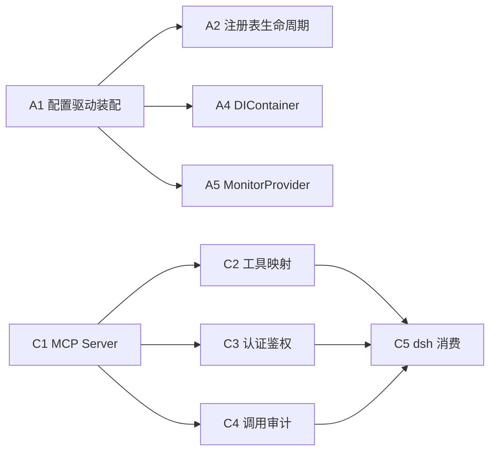

# 一鉴到底 × DeepSeek Harness 融合方案 A+C 分工文档

> 分工对象：**你** = 一鉴到底桌面端项目（当前仓库内实现）
> **hsh** = [deepseek-harness](https://github.com/deepseek-ai/deepseek-harness)（`dsh`，DeepSeek 官方开源 agent harness）
> 本文档仅覆盖 **方案 A** 与 **方案 C**（方案 B 暂时搁置，待 C 跑通后再评估）

---

## 1. 背景与目标

- 现有桌面端已具备民用级 Agent Harness 骨架（事件总线、插件注册表、工具注册表、执行分发桥接、治理引擎）。
- 目标：在不推倒现有架构的前提下，通过 **方案 A（内部架构增量演进）** + **方案 C（对外暴露 MCP 治理能力）**，让一鉴到底成为既有本地实时治理能力、又能被外部 agent（如 dsh）安全调用的宿主。
- 核心约束：不改变现有治理引擎的外部行为（A 是重构）；新增能力层不影响现有逻辑（C 是扩展）。

---

## 2. 方案 A：桌面端增量演进为 Agent Harness（你主导）

> 纯桌面端内部架构演进，与 hsh 无直接依赖。目的是消除技术债、让现有 Harness 骨架真正可用。

| 序号 | 任务模块 | 谁做 | 说明 | 依赖 |
|------|----------|------|------|------|
| A1 | 配置驱动插件安装/注册 | 你 | 将 `main.ts` 的硬编码装配改为配置驱动，落地插件化第一档（S1 的延续） | 无 |
| A2 | 插件注册表生命周期优化 | 你 | 可逆副作用、依赖解析、热重载骨架（沿用 PluginRegistry 现有能力） | A1 | ✅ 已完成（2026-08-17） |
| A3 | 事件总线持久化 | 你 | 当前 AgentEventBus 为内存流，增加可选持久化层（落盘/重放） | 无 | ✅ 已完成（2026-08-17） |
| A4 | DIContainer 完善 | 你 | 消除 `import 单例` 技术债，改为容器注入统一管理 | A1 |
| A5 | 监控器家族统一接口 | 你 | 在已落地的 MONITOR_RUNNERS 基础上，抽象出 MonitorProvider 接缝（可替换实现） | A1 |

**hsh 在方案 A 中的职责**：无（不参与桌面端内部重构）。

---

### 方案 A1 拆解：配置驱动装配（代码实现任务清单）

> 现状：装配逻辑全部硬编码在 `electron/main.ts` 的 `initializeServices()`（服务 `new` + `container.register`、6 个监控 runner、2 处插件 install）。
> 目标：新增第 7 种监控 / 服务 / 插件时**不改 main.ts 装配代码**。
> 设计模型 = 两层：**声明式配置层**（JSON：启用哪些 + 参数）+ **代码注册表层**（factory 注册表：怎么创建）。

| 任务 | 文件 | 内容 | 验收标准 | 状态 |
|------|------|------|----------|------|
| T1 装配配置 Schema | `electron/config/assemblySchema.ts` | `ServiceDeclaration` / `MonitorDeclaration` / `PluginDeclaration` / `AssemblyConfig` 类型 | 类型能描述当前 main.ts 全部装配 | ✅ 已完成 |
| T1.2 默认配置与归一化 | `electron/config/assemblyConfig.ts` | `DEFAULT_ASSEMBLY_CONFIG`（与现状 1:1 对齐）+ `normalize`/`load`/`save`（仿 permissionConfig 的 userData JSON 模式） | 单测覆盖 normalize/load/save；默认配置完整描述现状装配 | ✅ 已完成 |
| T2 工厂注册表 | `electron/assembly/factories.ts` | `serviceFactories` / `monitorFactories` / `pluginFactories` 三个注册表；工厂签名 `(ctx, params) => instance`，依赖经 `ctx.resolve()` 获取 | main.ts 不再出现 `new FileMonitor()` 等构造，依赖全部经容器解析 | ✅ 已完成 |
| T3 装配执行器 | `electron/assembly/assembler.ts` | `createAssembler(config, deps).assemble()`：按序实例化 service → 注册 container → 生成监控 runner → 安装 plugins；单步失败 fail-fast + error 日志 | 装配结果与手工装配等价；单测覆盖缺依赖/失败场景 | ✅ 已完成 |
| T4 治理栈组装 | `electron/assembly/bootstrap.ts` | 把"运行时特殊接线"集中：内置工具注册、后端/evidence/risk 模块配置、toolBridge/governanceEngine 组装、插件钩子接入 | 治理栈接线与手工等价，UI 回调经 opts 注入 | ✅ 已完成 |
| T4.3 main.ts 改造 | `electron/main.ts` | 用 `createAssembler(loadAssemblyConfig())` 替换硬编码注册段；监控 runner 由装配器生成，permissionGating.getMonitor 按 key 查询不变 | tsc 0 error；启动日志装配清单与现状一致 | ✅ 已完成 |
| T5 扩展性验证 | `electron/assembly/assembler.test.ts` | 单测：追加第 7 个 monitor 声明 + 注册第 7 个工厂 → 装配器自动生成 runner，**main.ts 零改动**；保留 6 监控回归断言 | 验收标准（新增监控不改 main.ts）被测试证明 | ✅ 已完成 |
| T6 收尾 | `docs/HARNESS_A_C_INTEGRATION_PLAN.md` + 全量测试 | 更新 M1 里程碑验收；tsc + 现有测试全绿 | 全量回归通过 | ✅ 已完成 |

**执行顺序**：T1 → T2 → T3 → T4 → T5 → T6（严格串行，每一步依赖前一步的类型/接口）。

**关键设计决策**：
- 配置默认内置（`DEFAULT_ASSEMBLY_CONFIG`），不强制落地 userData JSON；用户级覆盖是可选项（仿权限配置）。
- 监控参数（如阈值）走 `params` 透传，不进死代码。
- 特殊接线（engine/logger/eventBus）不强行通用化，避免过度抽象——只收敛"可枚举的服务/监控/插件"。
- 回归基准：现有 6 监控 + 2 插件行为不变。

---

## 3. 方案 C：桌面端作为宿主对外暴露 MCP 治理能力（你主导 + hsh 消费）

> 一鉴到底新增 MCP Server 层，把 GovernanceEngine 关键能力封装为 MCP tools，供外部 agent（含 dsh）调用。这是现有架构的自然延伸，只需在边界添加一层，不改动内部逻辑。

| 序号 | 任务模块 | 谁做 | 说明 | 依赖 | 状态 |
|------|----------|------|------|------|------|
| C1 | MCP Server 层 | 你 | 新增 MCP Server（Streamable HTTP，stateless），把治理能力注册为 MCP tools：权限审计、规则时效性、性能漂移检测、风险拦截查询等 | 无 | ✅ 已完成 |
| C2 | 工具注册表映射 | 你 | 将现有 ToolRegistry 映射为 MCP tool 定义（name/description/inputSchema） | C1 | ✅ 已完成 |
| C3 | 认证与鉴权 | 你 | 每个 MCP 调用需携带桌面端 JWT 或 API Key，校验通过才放行（fail-closed） | C1 | ✅ 已完成 |
| C4 | 调用审计日志 | 你 | MCP 调用接入现有 GovernanceLogger，记录谁在何时调用了哪些治理能力 | C1 | ✅ 已完成 |
| C5 | MCP 客户端消费 | hsh | dsh 作为 MCP client 调用一鉴到底暴露的治理能力（对应 dsh 的 MCP 客户端插件） | C1-C3 | ⏳ 待 dsh 接入 |

**你与 hsh 的接口边界**：C1-C4 由你产出，暴露的 tool schema 需与 dsh 的 MCP client 对齐；C5 由 hsh 消费。双方以 MCP tool schema 文档为契约。

---

## 4. 总体分工原则

- **你**：方案 A（内部架构） + 方案 C（对外暴露能力）——这是桌面端的核心价值。
- **hsh**：底层 Agent 运行时、沙箱执行、Web UI，以及作为 MCP client 消费 C 暴露的能力。
- **方案 B（桌面端作为 dsh 插件）**：暂缓，等 C 跑通、dsh 插件生态成熟后再评估。

---

## 5. 执行顺序与依赖

- **A 系列**：A1 → A2/A4/A5，内部重构，可与 C 并行，互不阻塞。
- **C 系列**：C1 → C2/C3/C4 → C5，串行推进；C5 需等 C1-C4 完成并产出 tool schema 后由 hsh 接入。

---

## 6. 里程碑与验收

| 里程碑 | 内容 | 验收标准 | 状态 |
|--------|------|----------|------|
| M1 | A1 配置驱动装配落地 | 新增第 7 种监控无需改动 main.ts 装配代码 | ✅ 已完成（2026-08-17） |
| M2 | A4/A5 容器与接缝 | 模块不再直接 import 单例；MonitorProvider 可替换实现 | ✅ 已完成（2026-08-17） |
| M3 | C1-C4 MCP Server | 治理能力可通过 MCP 协议被外部调用，无鉴权调用被拒绝 | ✅ 已完成（2026-08-17） |
| M4 | C5 dsh 消费 | dsh 能成功调用一鉴到底的 MCP 治理工具并返回结果 | ⏳ 待启动 |

---

## 7. 风险与注意

- 方案 A 是重构：必须保持行为不变，回归以全量测试（48 文件 / 637 通过 + 1 环境敏感跳过）+ tsc 零错误为准。
  - 注：CI 沙箱对 `C:\mock\home\logs\` 的 EPERM 限制会记 6 个环境 errors（不影响测试判定），属既有环境问题，与本方案改动无关。
- 方案 C 是边界扩展：MCP Server 需独立进程/线程，避免阻塞桌面端主线程（遵循大文件异步 I/O 约束）。
- MCP 调用鉴权必须 fail-closed：未带有效凭证一律拒绝，并写入审计日志。
